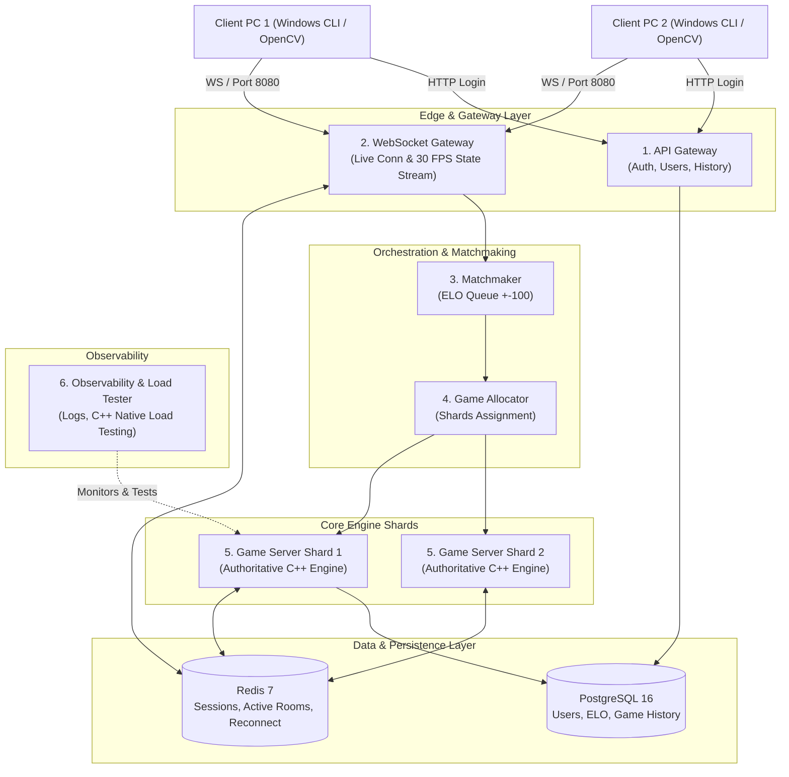

# KungFu Chess — Distributed Authoritative Real-Time System


High-performance, multi-computer real-time chess engine where both players execute moves simultaneously without turn constraints. The system features airborne piece trajectories, mid-air collisions, authoritative C++ engine validation, responsive rendering, Docker orchestration, and persistent PostgreSQL and Redis integration.

---

## Architecture Overview (6 Core System Components)

The architecture follows a distributed authoritative model designed to handle concurrent game instances at scale (target volume: 10 Million Concurrent Connected Users / 10M CCU).



---

## Component Breakdown

| Component | Functionality | Implementation / Reference |
|---|---|---|
| **1. API Gateway** | Authentication, user registration, and persistent record access | `src/io/user_manager.cpp` |
| **2. WebSocket Gateway** | Manages persistent client connections and 30 FPS state broadcasts | `src/network/socket_server.cpp` |
| **3. Matchmaker** | ELO-based matchmaking queue (+-100 ELO tolerance) | `SocketServer::process_matchmaking` |
| **4. Game Allocator** | Room assignment and server shard routing | `SocketServer::m_rooms` |
| **5. Game Server Shards** | Authoritative C++ GameEngine (Single Source of Truth) | `src/engine/game_engine.cpp` |
| **6. Observability** | Native C++ load testing, activity logging, and system metrics | `tests/load/load_tester.cpp` |

---

## SOLID Design & Micro-Services Architecture

The project adheres to **SOLID software design principles**:
- **Single Responsibility Principle (SRP)**: Separated persistence responsibilities into dedicated classes:
  - `GameHistoryLogger`: Writes PostgreSQL-compatible match audit records (`src/io/game_history_logger.cpp`).
  - `RedisSessionStore`: Manages async non-blocking RESP TCP session key storage and TTLs in Redis (`src/io/redis_session_store.cpp`).
  - `UserManager`: Handles user authentication and ELO rating math exclusively (`src/io/user_manager.cpp`).
- **Non-Blocking Network Architecture**: Asynchronous detached worker threads handle Redis state synchronization and DB audit logs without impeding the 60 FPS primary rendering loop.

---

## Scale and Traffic Estimates (10M CCU Scale)

- **Concurrent Active Games**: 5,000,000 active room instances.
- **Upstream Network Ingestion**: ~0.8 Gbps aggregated move payload volume.
- **Downstream Broadcast Payload**: ~480 Gbps aggregated state update volume at 30 FPS.
- **Shard Container Topology**: Distributed across worker container instances (25,000 active rooms per shard).

---

## Key Technical Features

- **Authoritative C++ Engine**: Game state and rules are computed entirely on the server; client input acts solely as execution requests.
- **Zero-Latency Event Dispatching**: State updates are broadcast immediately upon validating player input.
- **Responsive Full-Screen Display**: Responsive OpenCV windowing configured for native monitor resolution without aspect distortion.
- **Multi-Computer LAN & Wi-Fi Operations**: Supports remote socket connections across network interfaces (0.0.0.0 binding).
- **Session Reconnection and Graceful Handling**: 20-second reconnection window backed by Redis session TTLs (`session:<username>`).
- **PostgreSQL Game Audit Trail**: Completed match details are logged via `GameHistoryLogger` to `game_history.log` for database ingestion.

---

## Getting Started

### Prerequisites

- Windows 10/11 (x64) or Linux environment
- MSVC C++17 Compiler / Visual Studio 2022
- OpenCV 4.x C++ SDK
- Docker & Docker Compose or Kubernetes (k8s/k3s)

---

## Execution and Deployment

### 1. Docker Compose Deployment

To compile and launch the full service stack (C++ Game Server, Redis, PostgreSQL):

```cmd
docker-compose up --build
```

### 2. Kubernetes (K3s / Minikube) Deployment

To deploy to a managed Kubernetes cluster with HPA autoscaling (up to 400 replicas):

```cmd
kubectl apply -f k8s/deployment.yaml
```

### 3. Multi-Computer LAN Configuration

**Server Host (Computer 1):**
```cmd
compile_app.bat
app.exe client <SERVER_IP> 8080 <username_1> <password>
```

**Client Host (Computer 2):**
```cmd
app.exe client <SERVER_IP> 8080 <username_2> <password>
```

---

## Data Inspection Commands

### Query PostgreSQL User Records and ELO
```cmd
docker exec -it kungfu_postgres psql -U shira -d kungfu_chess -c "SELECT * FROM users;"
```

### Query PostgreSQL Game Logs
```cmd
docker exec -it kungfu_postgres psql -U shira -d kungfu_chess -c "SELECT * FROM games;"
```

### Inspect Active Redis Session Keys
```cmd
docker exec -it kungfu_redis redis-cli KEYS "session:*"
```

---

## Automated Load Testing

Run the native C++ load test simulating 50 concurrent client connections:

```cmd
run_load_test.bat
```

---

## Author

- **Shira Azuelos** — Computer Science Engineering Project
